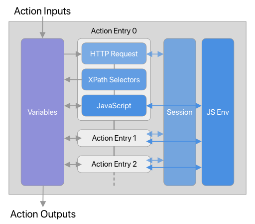

# CampNet-Configurations

<!-- MarkdownTOC -->

- [Specs](#specs)
  - [SSIDs: `[String]`](#ssids-string)
  - [Decimal Units: `Bool`](#decimal-units-bool)
  - [Actions: `{String: [ActionEntry]}`](#actions-string-actionentry)
    - [Action Entry: `{String: Any}`](#action-entry-string-any)
      - [HTTP Method: `String`](#http-method-string)
      - [URL: `String`](#url-string)
      - [Parameters: `{String: String}`](#parameters-string-string)
      - [Headers: `{String: String}`](#headers-string-string)
      - [Body: `String`](#body-string)
      - [XPath Selectors: `{String: XPath}`](#xpath-selectors-string-xpath)
      - [Off-campus If Failed: `Bool`](#off-campus-if-failed-bool)
      - [JavaScript: `String`](#javascript-string)
    - [Action Types](#action-types)
      - [Login](#login)
      - [Status](#status)
      - [Logout](#logout)
      - [Profile \(Optional\)](#profile-optional)
      - [History \(Optional\)](#history-optional)
      - [Login IP \(Optional\)](#login-ip-optional)
      - [Logout Session \(Optional\)](#logout-session-optional)

<!-- /MarkdownTOC -->

## Specs

### SSIDs: `[String]`
List of SSIDs of the campus Wi-Fi.

These networks will be marked as "On Campus", i.e. auto-login (if enabled) will
be performed on these networks.

```yaml
ssids:
  - Tsinghua
  - Tsinghua-5G
```

### Decimal Units: `Bool`
Whether to use decimal units for bytes. Default: `false`.

* If set to `true`, 1 KB = 1000 B.
* If set to `false`, 1 KB = 1024 B.

```yaml
decimal_units: true
```

### Actions: `{String: [ActionEntry]}`

Definitions of network-related actions. Each action consists of a variable pool,
a HTTP session, a JavaScript environment, as well as a list of action entries.

```yaml
actions:
  <action name>:
    - <entry 1>
    - <entry 2>
    # ...
```

Each entry can have the following optional stages:

* HTTP Request
* XPath Selectors (require HTTP Request)
* JavaScript

Action entries can read/write variables from/to the variable pool. Before the
first entry, action inputs are put into the pool. After the last entry, action
outputs are extracted from the pool:



#### Action Entry: `{String: Any}`

##### HTTP Method: `String`

Method of the HTTP request. Default: `GET`.

```yaml
method: POST
```

##### URL: `String`

URL of the HTTP requests. If not specified, the HTTP request stage will be
skipped.

`{var_name}` will be replaced with the value of `var_name` if it can be found in
the variable poll.

```yaml
url: https://net.tsinghua.edu.cn/users/{username}
```

##### Parameters: `{String: String}`

Parameters of the HTTP request. For GET requests, they will be added to the
HTTP query strings. For other requests, They will be `x-www-form-urlencoded` and
go to the HTTP body. For other form encodings, please set headers and body
manually.

`{var_name}` in keys and values will be replaced with the value of `var_name` if
it can be found in the variable poll.

```yaml
params:
  action: login
  username: "{username}"
  password: "{password_md5}"
  ac_id: "1"
```

##### Headers: `{String: String}`

Headers of the HTTP request. Corresponding headers will be overridden.

`{var_name}` in keys and values will be replaced with the value of `var_name` if
it can be found in the variable poll.

```yaml
headers:
  Content-Type: application/json
  User-Agent: "{user_agent}"
```

##### Body: `String`

Body of the HTTP request. If set, will override the body set by `params`.

`{var_name}` will be replaced with the value of `var_name` if it can be found in
the variable poll.

```yaml
headers:
  Content-Type: application/json
  User-Agent: "{user_agent}"
```

##### XPath Selectors: `{String: XPath}`

Parse the HTTP response as HTML, select variables into the variable pool using
XPaths.

* If the key is `var_name`, the trimmed text of the first match will be assigned
to `var_name`.
* If the key is `var_name[]`, an array of trimmed texts of all the matches will
be assigned to `var_name`.

```yaml
vars:
  balance: (//td[@class="maintd"])[34]
  usage: (//td[@class="maintd"])[26]
  ips[]: //tr[position()>=2]/td[2]
```

##### Off-campus If Failed: `Bool`

Whether to change the status to `offcampus` if the HTTP request fails. Default:
`false`.

Most campus networks don't have a reliable way to check whether the device is
off-campus. This option provides a way to do that.

```yaml
offcampus_if_failed: true
```

##### JavaScript: `String`

The JavaScript

* `url: String`: Full URL of the (possibly redirected) request.
* `resp: String`: Body of the HTTP response.
* `vars: {String: Any}`: Variable pool (only `String` & `Int` can go to
   placeholders).

Notice that you can also use variables defined in the previous action entries.

For conveniences, the following hash functions are pre-defined in the JavaScript
environment:

* `function md5(String): String`
* `function sha1(String): String`

You can also throw strings to indicate errors. Supported errors are:

* `offcampus`: Set the status to `offcampus`.
* `offline`: Set the status to `offline`.
* `unauthorized`: Incorrect username or password.
* `arrears`: The account is in arrears.
* `unknown: <description>`: Other errors with custom descriptions.

The following errors are mostly used internally, but you can throw them anyway:

* `network_error`: Network error.
* `invalid_configuration`: Invalid configuration file.
* `internal_error`: Internal error.

```yaml
script: |
  var matches = /index_(\d+)/.exec(resp);
  if (!matches) {
    throw 'unknown: ' + resp;
  }
  vars.ac_id = matches[1];ine_username = info[0];
```

#### Action Types

Default inputs:

* `username: String`: Username of the account.
* `password: String`: Password of the account.

##### Login

* Extra inputs: None.
* Expected outputs: None.

##### Status

* Extra inputs: None.
* Expected outputs:
    * `status: String`: `online`, `offline` or `offcampus`.
    * `online_username: String` (optional): The current online username if
      `status` is `online`.

##### Logout

* Extra inputs: None.
* Expected outputs: None.

##### Profile (Optional)

* Extra inputs: None.
* Expected outputs:
    * `name: String` (optional): Real name of the account owner.
    * `balance: Double` (optional): Balance of the account.
    * `data_balance: Int` (optional): Data balance of the account in bytes.
    * `usage: Int` (optional): Usage of the account in bytes.
    * `free_usage: Int` (optional): Free usage of the account in bytes.
    * `max_usage: Int` (optional): Max usage of the account in bytes.
    * `sessions: [Session]` (optional): Current online sessions.
        * `ip: String`: Session IP.
        * `id: String` (optional): Session ID.
        * `start_time: Date` (optional): Start time of the session.
        * `usage: Int` (optional): Usage of the session in bytes.
        * `mac: String` (optional): MAC address of the session.
        * `device: String` (optional): Device name of the session.

##### History (Optional)

* Extra inputs:
    * `year: Int`: Current year.
    * `month: Int`: Current month (1-12).
    * `day: Int`: Current day (1-31).
* Expected outputs:
    * `usage_sums: [Int]`: Cumulative sums of the usage this month in bytes.

##### Login IP (Optional)

* Extra inputs:
    * `ip: String`: IP address to login.
* Expected outputs: None.

##### Logout Session (Optional)

* Extra inputs:
    * `ip: String`: Session IP.
    * `id: String`: Session ID (empty if not existed).
* Expected outputs: None.
